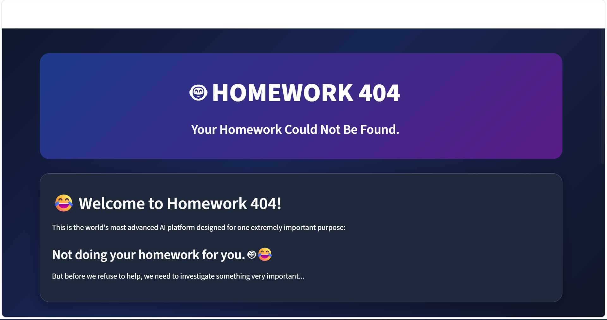

# [Project Name] 🎯 Homework-404

## Basic Details
### Team Name: Zero Purpose

### Team Members
Team Lead: NEHA L - Jyothi Engineering College
Member 2: ANCY BINU - Jyothi Engineering College

### Project Description
**Homework 404** is a fun and interactive parody AI web application designed using **Python and Streamlit**. The project humorously analyzes the reasons why students did not complete their homework instead of actually solving it. Users can select or enter their excuses, provide a homework question, and even upload an image of their homework. The system then performs a simulated AI analysis and generates entertaining results such as excuse believability, laziness level, and excuse type. The final outcome reminds users that **AI cannot replace their own effort and encourages them to do their homework themselves.** 

### The Problem (that doesn't exist)
Homework 404 is a humorous parody project built around a problem that technically does not need a solution: students looking for excuses instead of completing their homework. The application uses a simulated AI system to analyze why a student did not do their homework, evaluate the quality and believability of their excuse, and generate entertaining results.

Instead of solving the homework question or providing shortcuts, the system humorously redirects the user toward the real solution—doing their homework themselves. Built using Python and Streamlit, Homework 404 combines fake AI processing, excuse analysis, interactive inputs, and humorous feedback to create an entertaining example of a deliberately useless yet creative application.

### The Solution (that nobody asked for)
Homework 404 provides a deliberately humorous solution to the non-existent problem of students needing help creating excuses for not completing their homework. The system allows users to select or enter an excuse, provide their homework question, and upload an image of the homework. It then performs a simulated AI analysis to evaluate the believability of the excuse, laziness level, and excuse type.

Instead of actually solving the homework, the application surprises the user with a humorous final recommendation:

📚 DO YOUR HOMEWORK YOURSELF!

The solution is designed purely for entertainment and demonstrates how a seemingly advanced AI system can be used for a completely useless yet creative purpose.

## Technical Details
Python – The main programming language used to develop the application.
Streamlit – Used to create the interactive web interface and application pages.
Random Module – Used to generate random excuse types, believability scores, and laziness levels.
Time Module – Used to create the simulated AI processing animation and progress bar.

🤖 Excuse Selection Module – Allows users to select or enter their reason for not doing homework.
✏️ Homework Input Module – Allows users to enter their homework question or doubt.
📷 Homework Upload Module – Allows users to upload an image of their homework.
🧠 Fake AI Processing System – Simulates an advanced AI analysis process.
📊 Excuse Analysis System – Generates humorous results such as believability, laziness level, and excuse type.
🎉 Result and Surprise Module – Displays the final humorous message encouraging users to do their homework themselves.

### Technologies/Components Used
Python
Streamlit
Streamlit, Plotly, Random, Time
Visual Studio Code (VS Code), Git, GitHub

### Implementation
For Software:
Homework 404 is implemented as an interactive web application using Python and Streamlit. The software collects the user's excuse, homework question, and optional homework image, then simulates an AI analysis process. It generates humorous statistics, visual charts, and a final verdict encouraging the user to complete their homework themselves.

# Installation
```bash
python -m pip install streamlit plotly
```
# Run
```
python -m streamlit run app.py
```
### Project Documentation
For Software:
Homework 404 is a humorous AI-based web application that analyzes a student's excuse for not completing homework instead of solving the homework for them. The user selects an excuse, enters the homework question, and uploads an image of the homework. The system then generates an entertaining analysis report containing metrics such as believability, laziness level, effort detected, and brain usage, along with an analysis chart and final AI verdict encouraging the student to complete the homework themselves.

# Screenshots
 
The homepage of Homework 404 introduces the humorous AI-based platform designed to analyze why students did not complete their homework.

![Screenshot2]

Users can enter the homework question that the system will pretend to investigate.

![Screenshot3]

Users can enter the homework question that the system will pretend to investigate.

# Diagrams
```text
        🤖 HOMEWORK 404
               │
               ▼
      ┌─────────────────┐
      │   User Opens    │
      │  Application    │
      └────────┬────────┘
               │
               ▼
      ┌─────────────────┐
      │ Select / Enter  │
      │     Excuse      │
      └────────┬────────┘
               │
               ▼
      ┌─────────────────┐
      │ Enter Homework  │
      │    Question     │
      └────────┬────────┘
               │
               ▼
      ┌─────────────────┐
      │ Upload Homework │
      │      Image      │
      └────────┬────────┘
               │
               ▼
      ┌─────────────────┐
      │ Fake AI         │
      │ Processing &    │
      │ Analysis        │
      └────────┬────────┘
               │
               ▼
      ┌─────────────────┐
      │ Generate Excuse │
      │ Analysis Report │
      └────────┬────────┘
               │
               ▼
      ┌─────────────────┐
      │ Display Chart & │
      │   AI Verdict    │
      └────────┬────────┘
               │
               ▼
      ┌────────────────────────┐
      │ 📚 DO YOUR HOMEWORK     │
      │      YOURSELF! 😂       │
      └────────────────────────┘

```
# Build Photos

The application humorously reveals that the best solution is to complete the homework yourself.


The fake AI generates humorous statistics including believability, laziness level, effort detected, and brain usage.


A visual chart displaying the simulated analysis results for the selected excuse


TEAM CONTRIBUTIONS
NEHA L
ANCY BINU


